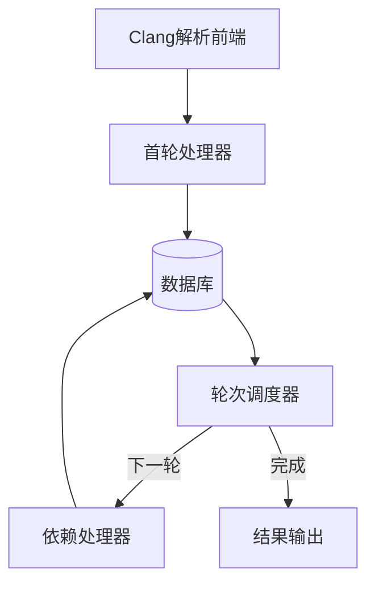
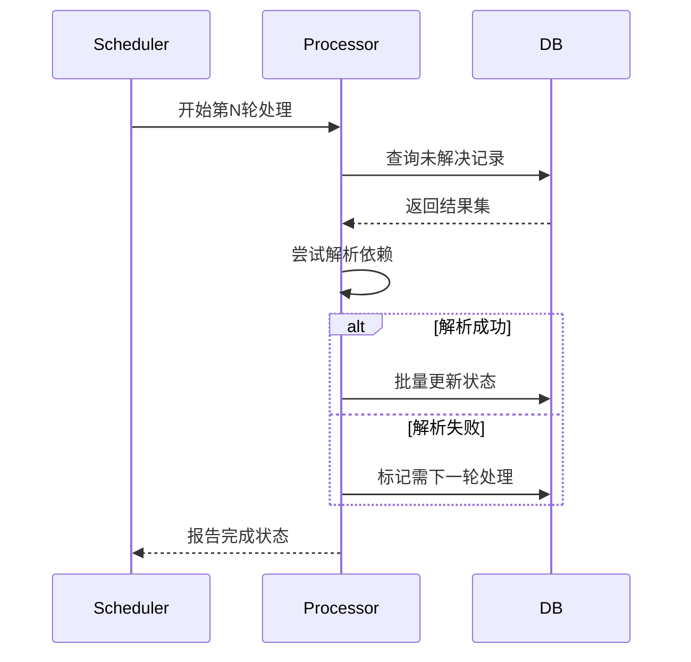

# 多轮解析系统设计文档

## 设计目标
1. 解决异步插入导致的跨表引用缺失问题
2. 实现同步三轮处理机制（最大重试次数=3）
3. 保持与现有Processor架构兼容
4. 确保数据库事务级数据可见性
5. 支持批量处理优化性能

## 系统架构


## 核心组件

### 1. 状态追踪系统（SQLModel扩展）
```cpp
class SQLModel {
public:
    // 状态管理接口
    void markForReprocess(uint8_t max_rounds = 3);
    bool requiresReprocessing() const;
    void advanceProcessingRound();
    
private:
    uint8_t current_round_ = 0;
    bool has_unresolved_deps_ = false;
    uint8_t max_processing_rounds_ = 3;
};
```

### 2. 轮次调度器（ProcessorScheduler）
```cpp
class ProcessorScheduler {
public:
    void executeProcessingRounds() {
        for (uint8_t round = 1; round <= MAX_ROUNDS; ++round) {
            notifyRoundStart(round);
            processCurrentRound(round);
            if (!hasPendingDependencies()) break;
        }
    }
};
```

### 3. 处理器扩展接口
```cpp
class BaseProcessor {
public:
    virtual void batchPostProcess(uint8_t current_round) = 0;
};
```

## 处理流程

### 第一阶段：初始解析
1. 生成基础数据模型
2. 设置占位符值（如container_id=0）
3. 标记需要重新处理

```cpp
// LocationProcessor首轮处理示例
void LocationProcessor::handle(CXCursor cursor) {
    auto model = createModelWithPlaceholder();
    model.markForReprocess();
    db.insert(model);
}
```

### 第二阶段：依赖解析
| 轮次 | 处理逻辑                   | 数据库操作        |
| ---- | -------------------------- | ----------------- |
| 1    | 生成基础数据，设置占位符   | 批量插入          |
| 2    | 解析依赖关系               | 批量更新          |
| 3    | 解析剩余依赖，记录未解决项 | 最终更新+错误日志 |

### 第三阶段：最终处理
1. 收集三轮后仍存在的未解决依赖
2. 生成错误报告
3. 清理临时状态标记

## 数据库优化

### 批量操作接口
```cpp
class SyncDatabase {
public:
    template <typename Model>
    void batchUpdate(std::vector<Model>& records) {
        executeTransaction([&](){
            for (auto& record : records) {
                execute(record.serialize());
            }
        });
    }
};
```

### 查询优化策略
1. 使用复合索引（processed_round + unresolved_deps）
2. 每轮次处理批量大小限制（默认1000条/批）
3. 查询结果缓存机制

## 错误处理机制


## 待确认事项
1. 最大处理轮次是否可配置化
2. 错误日志存储格式要求
3. 是否需要保留中间处理结果